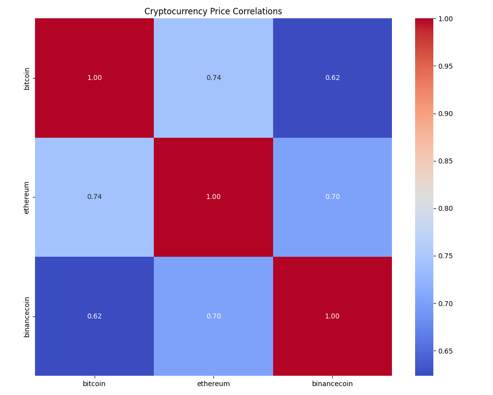

# Crypto Price Correlation Dashboard

## 🚀 Overview
The **Crypto Price Correlation Dashboard** is a Python-based project that analyzes and visualizes the correlations between cryptocurrency prices. Using historical price data fetched from the CoinGecko API, it calculates correlation matrices and generates heatmaps to showcase the relationships between cryptocurrencies.

---

## ✨ Features
- Fetches historical price data for selected cryptocurrencies using the CoinGecko API.
- Calculates daily percentage changes to normalize the data.
- Generates a correlation matrix and visualizes it as a heatmap.
- Saves the heatmap for future reference.
- Easily extensible for adding interactive dashboards using Streamlit or Dash.

---

## 📷 Demo
Here’s an example of the generated correlation heatmap:



---

## 🛠️ Setup Instructions

### Prerequisites
- Python 3.10 or later
- Required Python libraries: `pandas`, `matplotlib`, `seaborn`, `requests`

### Installation
1. Clone the repository:
   ```bash
   git clone https://github.com/Mohsentinal/crypto-correlation-dashboard.git
   cd crypto-correlation-dashboard
